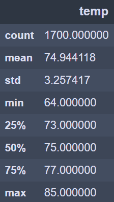
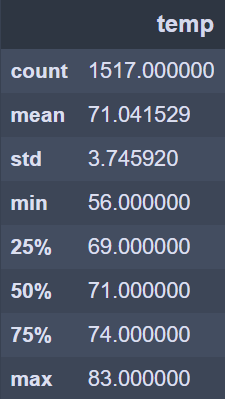

# Surfs_up Analysis
Module 9
## Overview of the analysis:
The purpose of this analysis was to help our investors W. Avy get an idea of the temperature trends for the month of June and December before deciding if our surf and ice cream shop business is sustainable year-round.

## Results:
At first, we made an sqlalchemy query to get the observed temperature ‘tobs’ for the month of June and December using the ‘func.strftime’ function. We then converted the results into a list using the ‘np.ravel’ function, then converted our list to a DataFrame, and used the ‘describe’ function to obtain the statistics summary.

‘’’
june_tobs = session.query(Measurement.tobs).\
    filter(func.strftime("%m", Measurement.date) == "06").all()
june_tobs

june_temp = list(np.ravel(june_tobs))
june_temp

df_june = pd.DataFrame(june_temp, columns=['June Temp'])
df_june

df_june.describe()
‘’’
 

## Summary:
Overall, this project ...
