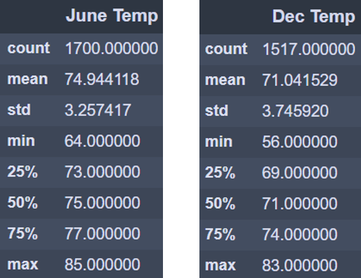
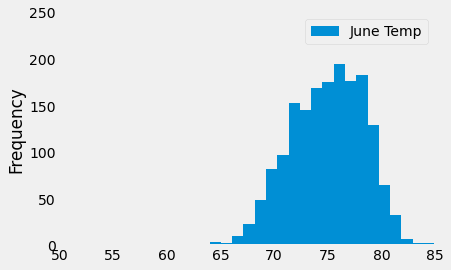
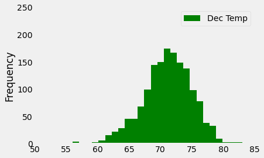
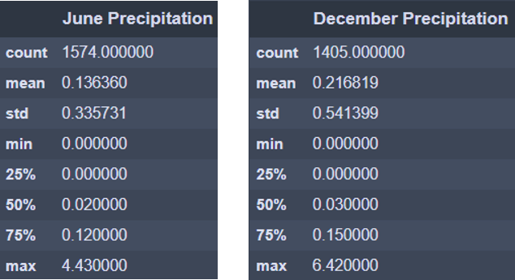

# Surfs_up Analysis
Module 9
## Overview of the analysis:
The purpose of this analysis was to help our investor W. Avy get an idea of the temperature trends and precipitations for the month of June and December before deciding if our surf and ice cream shop business is sustainable year-round.

## Results:
•	At first, we made an sqlalchemy query to get the observed temperature `tobs` for the month of June and December using the `func.strftime` function. We then converted the results into a list using the `np.ravel` function, then converted our list to a DataFrame, and used the `describe` function to obtain the statistics summary. We then repeated for precipitation `prcp`.

```
june_tobs = session.query(Measurement.tobs).\
    filter(func.strftime("%m", Measurement.date) == "06").all()
june_tobs

june_temp = list(np.ravel(june_tobs))
june_temp

df_june = pd.DataFrame(june_temp, columns=['June Temp'])
df_june

df_june.describe()
```
 
•	We can see from the `DataFrame` and the `histogram` that the average (mean) and median (50%) temperature is ~75 F for June while it is ~71 F for December. While it is a little bit cooler in December, temperatures are below 69 F only 25% of the time. 










•	For the precipitation statistics `DataFrame` we see that June receives an average of 0.14 inches of rain while it is at 0.22 inches for December.




## Summary:
•	Overall, temperatures are relatively warm year-round in Oahu.

•	Surfing with wetsuits is still good in low 60s but surfers may not want a refreshing ice cream below 65 F. Luckily for us, these lows represent only ~8% of the temperature measurement counts, which would be 2 to 3 days a month. 

•	Precipitations are also relatively low for those two months which is excellent for surfing!

•	Overall, we think Oahu is a great location for our surf and ice cream business plan and we believe it would be profitable year-round.

